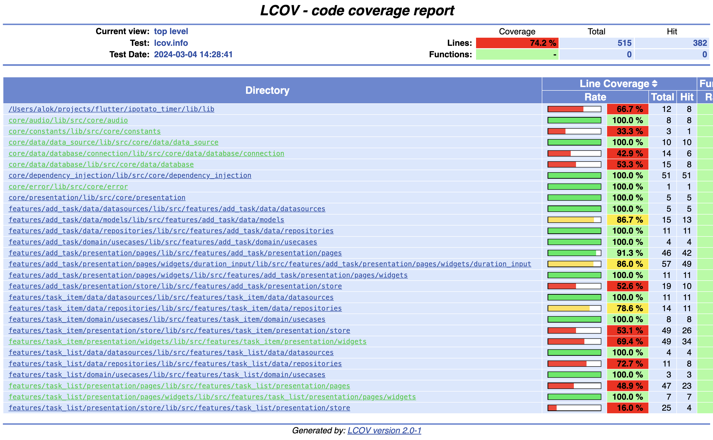

# iPotato Timer

---

## Description

This Flutter application enables users to create and manage multiple timers effortlessly. The app is built using clean architecture principles, ensuring modularity, testability, and scalability.

---

## Features

- **Multiple Timers:** Users can create and manage multiple timers simultaneously.
- **Customization:** Each timer can be customized with a unique name, duration, and description.
- **Countdown Display:** Timers display remaining time in a clear and intuitive format.
- **Audio:** An audio is played once timer is finished.
- **Persistent Storage:** Timer configurations are saved locally for seamless user experience across sessions.

---

## Clean Architecture

The app follows clean architecture principles, separating concerns into layers:

- **Presentation Layer:** Contains UI components, state management, and handles user interactions.
- **Domain Layer:** Contains business usecases.
- **Data Layer:** Handles data retrieval and storage, interacts with external data sources.

---

## Technologies Used

- **Flutter SDK:** Version 3.19.1
- **Dart:** Programming language for Flutter development.
- **MobX:** State management solution for managing app state and dependency injection.
- **drift+sqlite3:** Used for local data storage.
- **Freezed:** Generate boilerplate code.
- **get_it:** Dependency injection.

---

## Test Coverage: 74%

The application is thoroughly tested to ensure reliability and robustness. Test coverage includes:

- **Unit Tests:** Testing individual functions and methods within the application.
- **Widget Tests:** Testing UI components and interactions.

Test coverage report -

 

---

## Screenshots

---

## Getting Started

1. Clone the repository.
2. Ensure Flutter SDK version 3.19.1 is installed.
3. Run `flutter pub get` to install dependencies.
4. Run the app on a simulator or physical device using `flutter run`.
